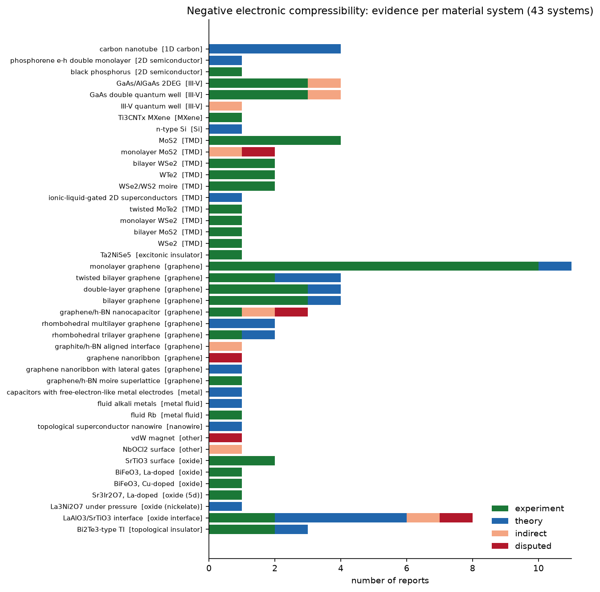

# NEC-Database

A curated database of materials reported to show **negative electronic compressibility (NEC)**, the regime in which the
chemical potential of the electron system decreases as carriers are added (dμ/dn < 0). Closely related signatures
included here are negative quantum capacitance and gate-capacitance enhancement beyond the geometric limit.

Every entry links a material to a published work and records the kind of evidence, the measurement or calculation
method, and the physical regime in which NEC appears.

## Contents

| File | Description |
|---|---|
| `database/nec_systems.csv` | One row per material system with evidence counts, status, methods, regimes and references |
| `database/nec_entries.csv` | One row per (work, material) with evidence type, method, regime and bibliographic data |
| `database/nec_database.json` | The same data nested as systems with their entries |
| `database/nec_candidates_unverified.csv` | Strong candidates whose full text could not be checked |
| `curation/nec_curation.csv` | Verdict for every screened work. This is the source of truth for the database |
| `scripts/` | Harvesting pipeline, database builder and `make_plots.py` |
| `figures/` | Overview figure of the database |
| `biomass/` | Catalog of 53,227 works on biomass-derived carbon materials and their NEC screening ([details](biomass/README.md)) |

## Current coverage

Literature screened on 9 October 2026: 373 works from OpenAlex and arXiv. The database holds 92 evidence entries for
43 material systems.



| System | Class | Status | Exp. | Theory | Indirect | Disputed | Earliest report |
|---|---|---|---|---|---|---|---|
| monolayer graphene | graphene | experimental | 10 | 1 | 0 | 0 | [2013](https://doi.org/10.1103/physrevlett.111.076802) |
| MoS2 | TMD | experimental | 4 | 0 | 0 | 0 | [2014](https://doi.org/10.1021/nl500212s) |
| bilayer graphene | graphene | experimental | 3 | 1 | 0 | 0 | [2014](https://doi.org/10.1126/science.1251003) |
| double-layer graphene | graphene | experimental | 3 | 1 | 0 | 0 | [2026](https://doi.org/10.48550/arxiv.2608.28381) |
| GaAs double quantum well | III-V | experimental | 3 | 0 | 1 | 0 | [2019](https://doi.org/10.1134/s002136401918005x) |
| GaAs/AlGaAs 2DEG | III-V | experimental | 3 | 0 | 1 | 0 | [1992](https://doi.org/10.1103/physrevlett.68.674) |
| LaAlO3/SrTiO3 interface | oxide interface | experimental | 2 | 4 | 1 | 1 | [2011](https://doi.org/10.1126/science.1204168) |
| twisted bilayer graphene | graphene | experimental | 2 | 2 | 0 | 0 | [2024](https://doi.org/10.1103/physrevb.109.155430) |
| Bi2Te3-type TI | topological insulator | experimental | 2 | 1 | 0 | 0 | [2016](https://doi.org/10.1063/1.4968183) |
| WSe2/WS2 moire | TMD | experimental | 2 | 0 | 0 | 0 | [2023](https://doi.org/10.48550/arxiv.2308.08134) |
| WTe2 | TMD | experimental | 2 | 0 | 0 | 0 | [2025](https://doi.org/10.1021/acsnano.5c00221) |
| bilayer WSe2 | TMD | experimental | 2 | 0 | 0 | 0 | [2016](https://doi.org/10.1103/physrevlett.116.086601) |
| SrTiO3 surface | oxide | experimental | 2 | 0 | 0 | 0 | [2016](https://doi.org/10.1038/srep25789) |
| rhombohedral trilayer graphene | graphene | experimental | 1 | 1 | 0 | 0 | [2021](https://doi.org/10.1038/s41586-021-03938-w) |
| black phosphorus | 2D semiconductor | experimental | 1 | 0 | 0 | 0 | [2015](https://doi.org/10.48550/arxiv.1510.08262) |
| Ti3CNTx MXene | MXene | experimental | 1 | 0 | 0 | 0 | [2021](https://doi.org/10.1063/5.0039918) |
| WSe2 | TMD | experimental | 1 | 0 | 0 | 0 | [2015](https://doi.org/10.1038/nnano.2015.217) |
| bilayer MoS2 | TMD | experimental | 1 | 0 | 0 | 0 | [2019](https://doi.org/10.1103/physrevlett.123.117702) |
| monolayer WSe2 | TMD | experimental | 1 | 0 | 0 | 0 | [2024](https://doi.org/10.1103/physrevx.14.031018) |
| twisted MoTe2 | TMD | experimental | 1 | 0 | 0 | 0 | [2023](https://doi.org/10.1038/s41586-023-06452-3) |
| Ta2NiSe5 | excitonic insulator | experimental | 1 | 0 | 0 | 0 | [2023](https://doi.org/10.1103/physrevresearch.5.043089) |
| graphene/h-BN moire superlattice | graphene | experimental | 1 | 0 | 0 | 0 | [2025](https://doi.org/10.1103/75gl-jzl6) |
| fluid Rb | metal fluid | experimental | 1 | 0 | 0 | 0 | [2007](https://doi.org/10.1103/physrevlett.98.096401) |
| BiFeO3, Cu-doped | oxide | experimental | 1 | 0 | 0 | 0 | [2024](https://doi.org/10.1063/5.0210841) |
| BiFeO3, La-doped | oxide | experimental | 1 | 0 | 0 | 0 | [2020](https://doi.org/10.1038/s41598-020-61859-6) |
| Sr3Ir2O7, La-doped | oxide (5d) | experimental | 1 | 0 | 0 | 0 | [2015](https://doi.org/10.1038/nmat4273) |
| graphene/h-BN nanocapacitor | graphene | contested | 1 | 0 | 1 | 1 | [2014](https://doi.org/10.1021/nl4037824) |
| carbon nanotube | 1D carbon | theoretical | 0 | 4 | 0 | 0 | [2004](https://doi.org/10.48550/arxiv.cond-mat/0412540) |
| rhombohedral multilayer graphene | graphene | theoretical | 0 | 2 | 0 | 0 | [2023](https://doi.org/10.1103/physrevb.108.l041101) |
| phosphorene e-h double monolayer | 2D semiconductor | theoretical | 0 | 1 | 0 | 0 | [2018](https://doi.org/10.1103/physrevb.98.245115) |
| n-type Si | Si | theoretical | 0 | 1 | 0 | 0 | [1992](https://doi.org/10.1103/physrevb.46.15123) |
| ionic-liquid-gated 2D superconductors | TMD | theoretical | 0 | 1 | 0 | 0 | [2018](https://doi.org/10.1103/physrevb.98.214507) |
| graphene nanoribbon with lateral gates | graphene | theoretical | 0 | 1 | 0 | 0 | [2014](https://doi.org/10.1103/physrevb.89.115406) |
| capacitors with free-electron-like metal electrodes | metal | theoretical | 0 | 1 | 0 | 0 | [2019](https://doi.org/10.1103/physrevb.99.235127) |
| fluid alkali metals | metal fluid | theoretical | 0 | 1 | 0 | 0 | [2010](https://doi.org/10.1021/je100627c) |
| topological superconductor nanowire | nanowire | theoretical | 0 | 1 | 0 | 0 | [2016](https://doi.org/10.1103/physrevb.93.064512) |
| La3Ni2O7 under pressure | oxide (nickelate) | theoretical | 0 | 1 | 0 | 0 | [2024](https://doi.org/10.1103/physrevb.109.165154) |
| III-V quantum well | III-V | indirect | 0 | 0 | 1 | 0 | [2021](https://doi.org/10.1016/j.mtelec.2023.100039) |
| monolayer MoS2 | TMD | indirect | 0 | 0 | 1 | 1 | [2015](https://doi.org/10.1038/ncomms7088) |
| graphite/h-BN aligned interface | graphene | indirect | 0 | 0 | 1 | 0 | [2022](https://doi.org/10.48550/arxiv.2211.16420) |
| NbOCl2 surface | other | indirect | 0 | 0 | 1 | 0 | [2026](https://doi.org/10.1038/s43246-025-01070-0) |
| graphene nanoribbon | graphene | disputed | 0 | 0 | 0 | 1 | [2014](https://doi.org/10.1063/1.4904715) |
| vdW magnet | other | disputed | 0 | 0 | 0 | 1 | [2025](https://doi.org/10.1038/s41467-025-56457-x) |

Status rules:
- `experimental`: at least one experimental report.
- `contested`: refutations are as many as the experimental reports.
- `theoretical`: calculations or predictions only.
- `indirect`: NEC proposed as an interpretation only.
- `disputed`: NEC looked for and not found.

## Evidence levels

Each screened work in `curation/nec_curation.csv` carries one verdict code.

| Code | Meaning | In database |
|---|---|---|
| E | NEC reported experimentally for this material | `experiment` |
| T | NEC calculated or predicted for this specific material | `theory` |
| P | NEC proposed as an interpretation of the data (indirect evidence) | `indirect` |
| D | Claim refuted, or NEC looked for and not observed | `disputed` |
| U | Strong candidate from the title, full text not accessible | candidates file |
| M | Generic theoretical model (Hubbard, jellium, 2DEG), no specific material | no |
| R | Review or perspective | no |
| X | NEC only mentioned in the introduction or references | no |
| N | Not electronic NEC (mechanical metamaterials, granular matter, lipids, cold atoms, cosmology, ferroelectric negative capacitance) | no |
| DUP | Duplicate of another work (preprint, conference abstract, cover) | no |
| NT | Matched by full-text search only, text not available | no |

## Entry fields

| Field | Description |
|---|---|
| `entry_id` | Stable within a build (`NEC-0001`, ...) and reassigned when the database is rebuilt. Use `work_id` plus `material` as a persistent key |
| `system` | Material system used for grouping, e.g. `monolayer graphene` |
| `material` | Specific sample or variant, e.g. `monolayer graphene (Ag adatoms)` |
| `material_class` | Broad class: graphene, TMD, III-V, oxide, oxide interface, MXene, ... |
| `evidence` | `experiment`, `theory`, `indirect` or `disputed` |
| `method` | How NEC was measured or computed, e.g. penetration-field capacitance, scanning SET, ARPES with surface doping |
| `regime` | Physical regime, e.g. low density at B=0, quantum Hall, moiré flat band, surface doping, device |
| `year`, `doi`, `arxiv_id`, `openalex_id`, `title`, `journal` | Bibliographic data |
| `note` | Curator remarks, e.g. refutations or caveats |

## How the database was built

1. **Search.** `scripts/openalex_search.py` queries OpenAlex titles and abstracts for "negative electron(ic)
   compressibility", "negative compressibility" with electronic terms, and "negative quantum capacitance". It also runs
   full-text searches for the exact phrases. `scripts/arxiv_search.py` queries arXiv abstracts.
2. **Merge.** `scripts/merge_works.py` removes duplicates by DOI, arXiv id and normalized title.
3. **Full text.** `scripts/arxiv_fulltext.py` downloads open-access arXiv versions and extracts their text.
4. **Pre-screening.** `scripts/extract_candidates.py` flags materials mentioned within one sentence of an NEC
   keyword. This automatic step reached about 70% precision.
5. **Manual curation.** Each work was judged from the NEC sentences in its abstract and full text. The verdict,
   material, method and regime were recorded in `curation/nec_curation.csv`.
6. **Build.** `scripts/build_database.py` generates everything in `database/` from the curation file.

Raw harvest output and cached article text are written to `data/`, which is not tracked because the texts are
copyrighted.

## Rebuilding and updating

Requirements: Python 3.11+ with `pandas`, `requests`, `lxml` and `pymupdf`.

```bash
# regenerate the database after editing curation/nec_curation.csv
python scripts/build_database.py

# re-run the harvest (writes to data/)
python scripts/openalex_search.py
python scripts/arxiv_search.py
python scripts/merge_works.py
python scripts/arxiv_fulltext.py      # about 3 s per PDF, cached
python scripts/extract_candidates.py
```

Set `OPENALEX_MAILTO=<email>` to use the OpenAlex polite pool. Its free daily budget is limited.

To add or correct an entry, edit the row in `curation/nec_curation.csv` and rebuild. A new work can be added as a row
with a new `work_id`.

## Limitations

- **Coverage.** Only OpenAlex and arXiv were searched. Scopus and Web of Science were not.
- **Sentence-level judgment.** Verdicts are based on the NEC sentences of each work, not a full reading.
- **Abstract-only papers.** Journal articles without an open-access version were judged from their abstracts only.
- **Unverified candidates.** 23 works whose publisher pages blocked automated access are listed in
  `database/nec_candidates_unverified.csv`. They include Ilani et al. 2006 (carbon nanotubes), which would add
  experimental evidence for carbon nanotubes.
- **Unchecked works.** 69 works matched only through OpenAlex full-text search and were not checked (`NT`).
- **Biomass-derived carbon.** No published report of NEC in biomass-derived or other porous carbons was found. It was
  screened across 89,899 works (Europe PMC and Semantic Scholar) and 208 open-access full texts. See `biomass/`.
- **Other carbon forms.** No electronic NEC was found in diamond, fullerenes, amorphous carbon, carbon nitride or
  graphene oxide. The fullerene result (Sc3N@C80) concerns mechanical volume compressibility.
