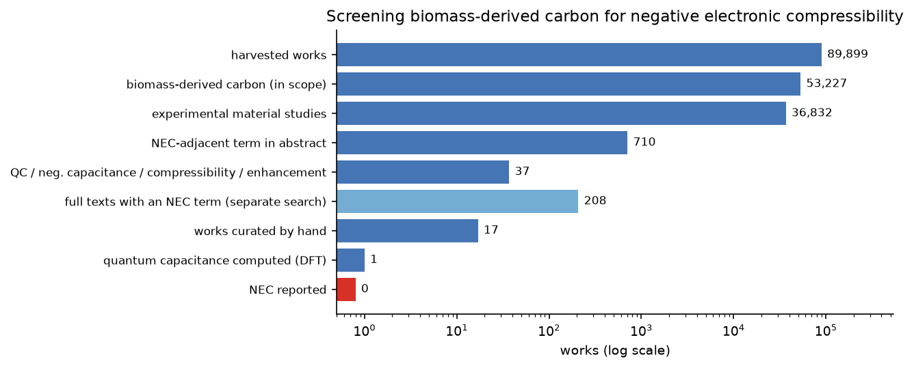
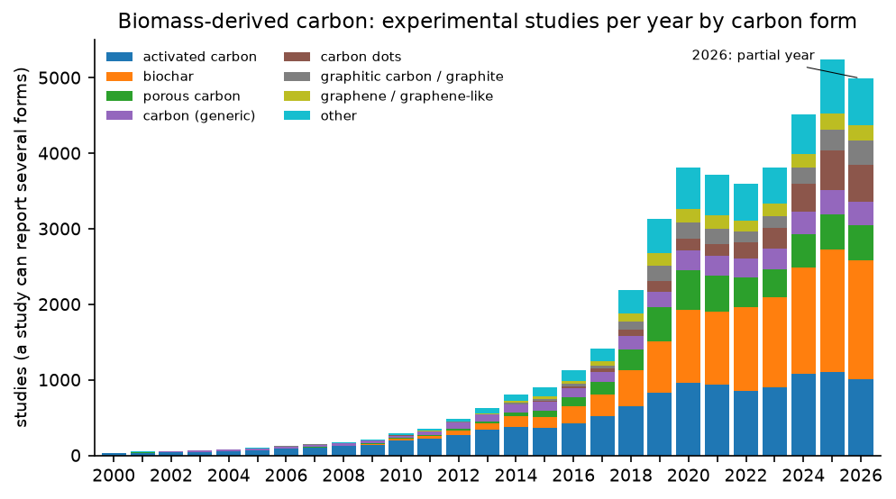
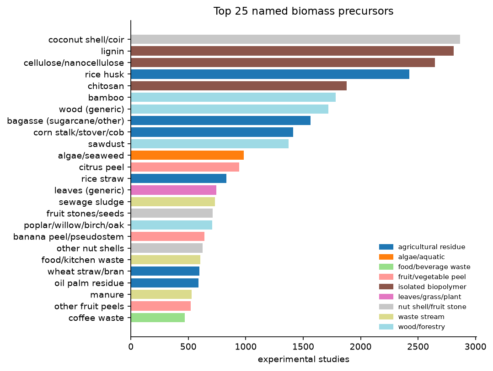
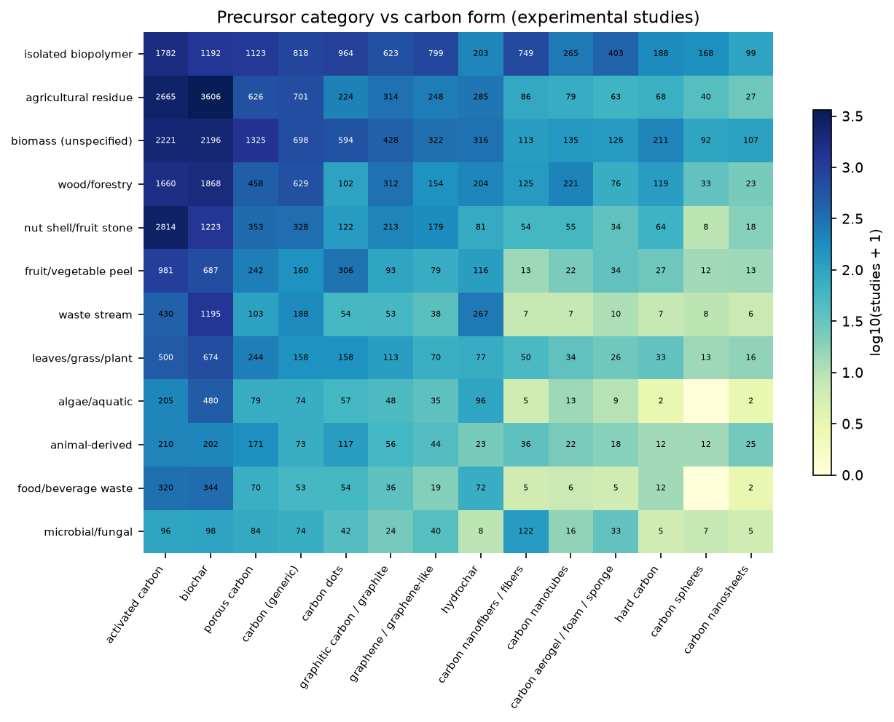
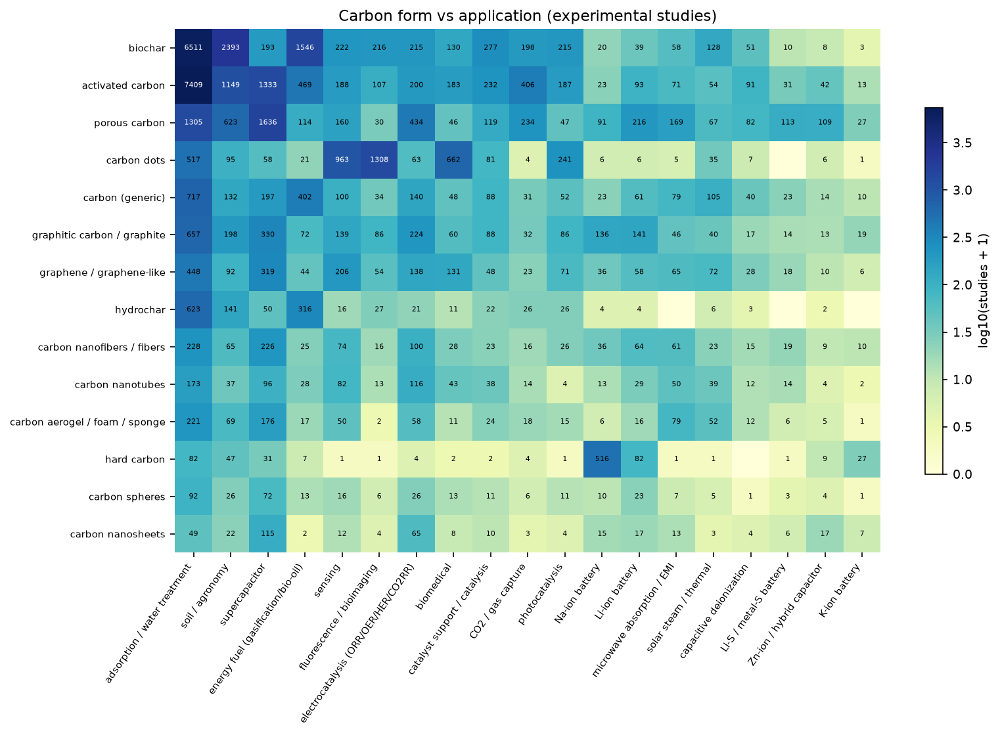
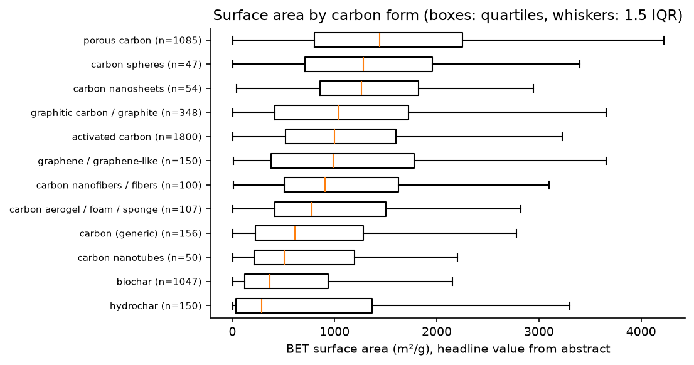
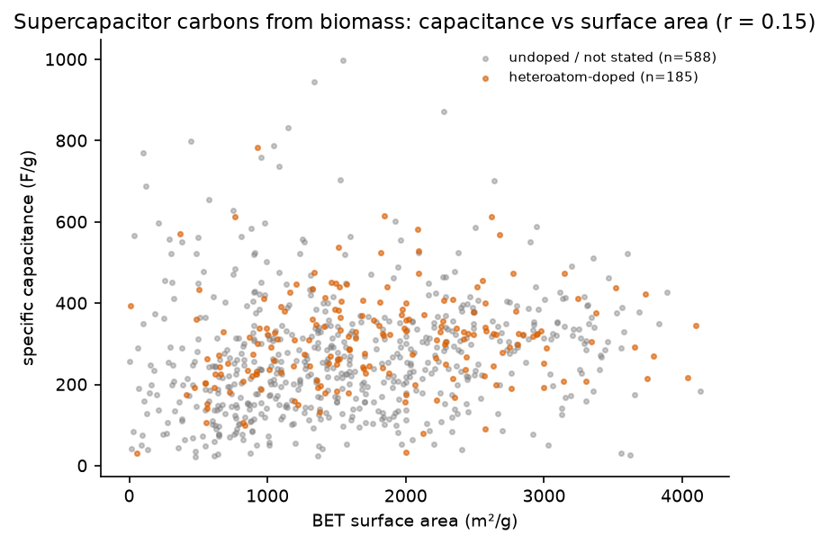

# Biomass-derived carbon materials

A literature catalog of carbon materials made from biomass (activated carbon, biochar, hydrochar, porous and
hard carbon, carbon dots, biomass-derived graphene, carbon fibers and aerogels), screened for negative electronic
compressibility (NEC) and related electronic signatures.

Harvested on 2026-10-09 from Europe PMC (24,465 records) and Semantic Scholar (89,540 records). After
deduplication by DOI and title that leaves 89,899 works, of which 53,227 are in scope. Of those, 36,832 are
experimental material studies.

## Main result for NEC

**No published work reports NEC, negative quantum capacitance, or a negative electronic compressibility in a
biomass-derived carbon.** This holds for abstracts across the whole corpus, for full text of 208 open-access
papers that use NEC-adjacent terms, and for targeted Semantic Scholar queries.

What does exist (`nec_screen.csv`):

| Verdict | Count | What it is |
|---|---|---|
| T-QC | 1 | DFT quantum capacitance of a biomass carbon. Okara-derived B,N-codoped porous carbon (ACS Omega 2022), C_Q positive and raised by codoping |
| U | 1 | Bamboo porous carbon with defect-driven capacitance enhancement (Chem. Eng. J. 2026), likely a DOS effect, full text not read |
| N | 4 | Not electronic NEC: an EIS sign artifact ("negative capacitance" of wood apple shell carbon), ionic confinement in gelatin carbon, a loose phrase in waste-battery graphene, and mechanical negative compressibility in a cellulose aerogel |
| X | 6 | Quantum capacitance or capacitance enhancement only cited or used as generic wording |
| R | 5 | Reviews that discuss quantum capacitance of porous carbons (no biomass NEC data) |

The literature treats quantum capacitance in these carbons as a positive series term,
1/C = 1/C_Q + 1/C_EDL, that limits the total capacitance. Doping (N, B, P, S) and defects are used to
*raise* the density of states and so C_Q. Nobody has looked for the opposite regime, dμ/dn < 0, in a
biomass carbon. The low-density, strongly correlated or gated 2D conditions where NEC appears in
graphene and 2DEGs (see the main database) have not been reached with these materials.

That makes it an open gap. Biomass-derived graphene/graphene-like sheets (1,749 studies), graphitic carbon (2,002),
and hard carbons (677) would be the closest candidates for a gated quantum-capacitance or penetration-field
measurement.

## Figures

Regenerate with `python scripts/make_plots.py`.



| | |
|---|---|
|  |  |
|  |  |
|  |  |

Specific capacitance barely tracks BET surface area across biomass supercapacitor carbons (r = 0.15, 773 studies
quoting both). Heteroatom-doped carbons do not stand out from the rest either.

## Files

| File | Content |
|---|---|
| `biomass_carbon_materials.csv` | 53,227 in-scope works, one row each, with the extracted fields below. No abstract text |
| `summary_precursors.csv` | Per precursor (72): study count, years, top carbon forms, applications, dopants, BET and capacitance medians/maxima |
| `summary_category_form.csv` | Precursor category x carbon form, experimental studies |
| `summary_applications.csv` | Carbon form x application, experimental studies |
| `nec_screen.csv` | Manual NEC screening of every work with an NEC-adjacent term (source of truth, edit by hand) |

### Fields in `biomass_carbon_materials.csv`

| Field | Meaning |
|---|---|
| `study_type` | experimental, review, patent, theory/other, or unknown (no abstract; title-only records count as experimental when the title says a material was made) |
| `material_study` | experimental work that makes or characterises the carbon, excluding pure field trials with biochar |
| `precursors`, `precursor_categories` | biomass source from a dictionary of 72 precursors in 12 categories. "biomass (unspecified)" only when no specific source was named |
| `carbon_forms` | activated carbon, biochar, hydrochar, porous carbon, hard carbon, carbon dots, graphene/graphene-like, graphitic carbon, CNT, fibers, aerogel/foam, spheres, nanosheets |
| `synthesis`, `activation_agents`, `max_temp_C` | process words (pyrolysis, hydrothermal, chemical/physical activation, template, microwave, flash Joule, laser, catalytic graphitization), agents (KOH, ZnCl2, H3PO4 ...), highest temperature quoted |
| `dopants` | heteroatoms from "N-doped", "N,S-co-doped" and similar, plus self-doped |
| `applications` | supercapacitor, Li/Na/K-ion, Li-S, Zn-ion, electrocatalysis, adsorption, CO2 capture, CDI, sensing, fluorescence, EMI, solar steam, soil, biomedical, fuel |
| `bet_m2g`, `spec_cap_Fg`, `capacity_mAhg`, `id_ig`, `conductivity_S_cm` | the largest value of each quantity quoted in the abstract |
| `nec_flags` | NEC-adjacent terms in title/abstract (quantum capacitance, negative capacitance, compressibility, capacitance enhancement, DOS, Fermi level/work function, Mott-Schottky, DFT) |

## Coverage at a glance (experimental material studies)

- Carbon forms: activated carbon 11,989, biochar 11,101, porous carbon 4,440, carbon dots 2,483, graphitic carbon 2,002,
  graphene-like 1,749, hydrochar 1,447, fibers 1,118, CNT 792, aerogel/foam 714, hard carbon 677.
- Top precursors: coconut shell 2,865, lignin 2,811, cellulose 2,648, rice husk 2,424, chitosan 1,878, bamboo 1,783,
  wood 1,721, bagasse 1,564, corn residues 1,414, sawdust 1,374.
- Applications: adsorption/water treatment 16,671, soil 4,241, supercapacitor 3,572, fuel/pyrolysis 2,787, sensing 1,880,
  fluorescence 1,699, electrocatalysis 1,380, Na-ion 714.
- Dopants: N 2,422, S 400, P 223, O 202, B 106.

## Method

1. `scripts/biomass_search.py` queries Europe PMC (title/abstract fields) and Semantic Scholar bulk search with
   31 biomass terms AND 21 carbon terms, then merges and deduplicates.
2. `scripts/biomass_extract.py` runs the regex extraction. A work is in scope when a precursor sits in the same or
   the neighbouring sentence as a carbon word, and there is evidence the carbon was made from it (a carbonization or
   activation step, a derived form such as biochar or activated carbon, or "X-derived"). Ambiguous precursors
   (glucose, cellulose, chitosan, alginate, blood, bone, hair, fungi, leaves ...) must sit within 60 characters of a
   carbon or derivation word.
3. `scripts/biomass_fulltext.py` runs Europe PMC full-text queries for biomass carbon AND an NEC-adjacent term,
   downloads the open-access XML, and writes every matching sentence for manual reading.
4. `scripts/biomass_summarize.py` writes the files in this folder.

```bash
PY=/path/to/python   # needs requests, lxml, pandas
cd scripts
$PY biomass_search.py          # ~20 min, mostly Semantic Scholar paging
$PY biomass_extract.py         # ~1 min on 8 processes
$PY biomass_fulltext.py        # ~5 min, cached
$PY biomass_summarize.py
$PY make_plots.py             # figures/ and biomass/figures/ (needs matplotlib)
```

## Limitations

- **Precision.** About 87% on a random sample of 40 experimental material studies. The main errors are a biopolymer
  used as binder or coating next to commercial carbon (chitosan beads, chitosan/GO membranes), raw biosorbents that
  were never carbonized, and "biomass" in its microbial sense.
- **Numbers.** Numbers are headline maxima from abstracts and have not been checked. Values above about 1,000 F/g
  usually belong to a metal-oxide composite, not to the carbon alone.
- **Coverage.**
  - About 40% of Semantic Scholar records have no abstract (mostly Elsevier), so they are classified from the
    title only.
  - OpenAlex was not used because its anonymous daily quota was exhausted.
  - Full-text NEC screening covers only Europe PMC open-access papers.
- **Ambiguous names.** Some precursor names are broad. "wood (generic)", "leaves (generic)" and
  "fruit stones/seeds" group many species, and the species name stays in the title.
